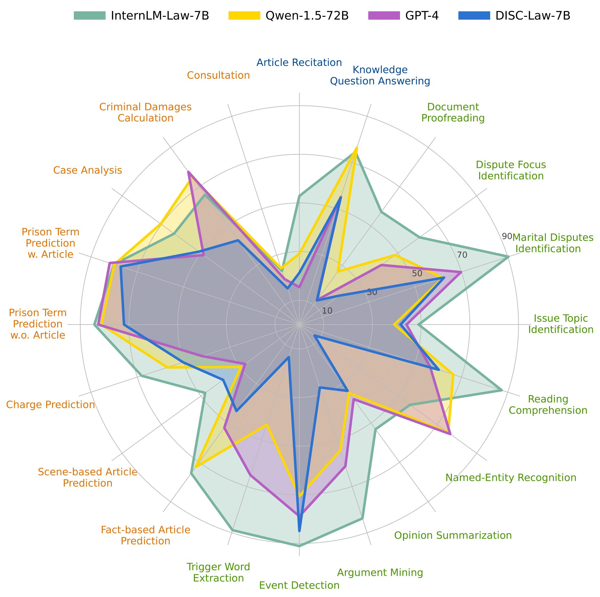
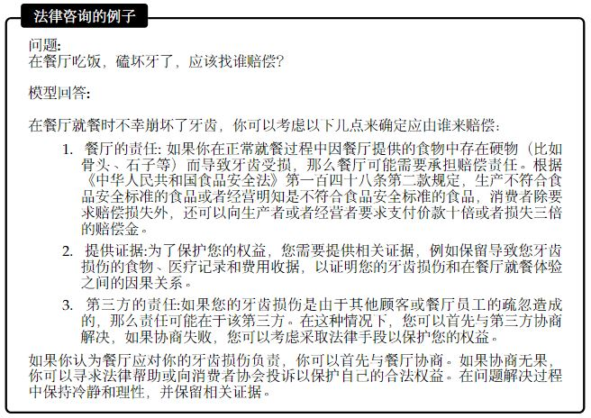

# InternLM-Law

<div align="center">


  <div> </div>
  <div align="center">
    <b><font size="5">InternLM-Law</font></b>
    <sup>
      <a href="https://internlm.intern-ai.org.cn/">
        <i><font size="4">HOT</font></i>
      </a>
    </sup>
    <div> </div>
  </div>

[](./LICENSE)

一个中文领域最优的法律模型。

# 新闻
- [2024.05.15] 我们发布了InternLM2-Law，一个优秀的中文领域法律大语言模型超过了一众公开的大语言模型包括公开的法律大模型和通用的大语言模型以及商业大语言模型GPT4。


# 介绍
我们在这个项目中公开一个面向中文司法领域的大语言模型InternLM-Law，并且公开了司法领域的长文本测试数据集和主观评测数据集。我们的法律大语言模型主要有以下的特点：

- **一个7B规模的法律大语言模型，在法律任务上的表现优于ChatGPT甚至GPT4。** InternLM-Law是基于InternLM2-Chat模型且采用了约100w条高质量和多样化的监督数据进行有监督微调。并且采用了两阶段的SFT训练策略，来平衡客观性能和主观能力。在训练过程中，我们将长度设置为32K，让模型能够处理法律领域中的长文本。

- **一个能够调用工具来辅助解决法律问题的模型。**不仅仅自身有着优秀的能力，在解决问题上，我们的模型还能够借助工具来更加精确的完成相关的任务。比如在需要数值计算的任务上，模型能够编写Python代码来求解法律领域的数值计算问题，进一步提升模型在一些问题上的准确率。我们的模型还能和现有的流行框架结合，让它的效果更加的准确。
- **能够服务多种场景的法律大语言模型。**在智慧司法领域中，有很多受众，我们的模型不仅仅能够为法律专业人员服务，同时也能够为普通的用户服务。它能够很好的完成一些法律相关的NLP任务，这让他能够服务于之前的各种司法系统，同时还能够提供良好的法律咨询服务，为多种多样的群体提供服务。



# 模型
**InternLM2-Law-7B** 是一个SFT模型。

| Model                | Model Type | Transformers(HF) | Release Date |
| -------------------- | ---------- | ------------------------------------------------------------ |
| **InternLM2-Law-7B** | SFT        | [🤗internlm/internlm2-law-7b](https://huggingface.co/internlm/internlm2-law-7b) | 2024-05-11   |


# 性能表现

我们展示了我们的模型在LawBench上的结果，LawBench是一个全面系统的测试大语言模型司法能力的数据集。它包含20个任务，从记忆、理解、应用三个认知层面对大语言模型的法律能力进行分析。我们挑选了最新的中文领域通用大语言模型和法律领域大语言模型进行对比，并且与目前最强的商业模型GPT4进行比较。从结果可以看出，我们的模型在三个维度上全面超过了目前公开的模型，包括更大规模的中文大语言模型Qwen-1.5-72B和GPT4。

| Models             | Model Type | Memorization | Understanding | Application | Avg  |
| ------------------ | ---------- | ------------ | ------------- | ----------- | ---- |
| GPT4               | General  | 35.29/36.01 | 54.41/56.48 | 54.05/55.01 | 52.35/53.85 |
| Qwen-1.5-7B        | General    | 19.16/19.00 | 39.19/43.62 | 49.75/50.40 | 41.41/43.87 |
| InternLM2-Chat-7B  | General    | 31.62/32.02 | 45.00/48.33 | 50.33/52.91 | 45.80/48.53 |
| Qwen-1.5-72B    | General    | 52.77/50.06 | 52.16/54.92 | 61.24/62.28 | 55.85/57.38 |
| Lawyer-LLaMA-13B | Legal      | 17.77/11.82 | 18.94/18.89 | 35.19/30.99 | 25.32/23.02 |
| ChatLaw-13B | Legal | 21.63/22.69 | 28.21/30.22 | 41.23/38.13 | 32.76/32.63 |
| Fuzimingcha-6B | Legal      | 16.51/16.51 | 30.10/23.83 | 40.86/38.04 | 33.05/28.78 |
| DISC-Law-7B | Legal | 38.05/37.02 | 36.43/38.07 | 48.94/53.14 | 41.60/43.99 |
| InternLM-Law(Ours) | Legal | **63.72/64.95** | **71.81/71.58** | **63.57/63.46** | **67.71/67.67** |

## 主观性能表现
一个法律大语言模型带给人的问答体验也非常重要，我们根据法律领域常见的几类开放领域问题来我们构建了一些法律领域的开放问答问题，这些问题涵盖了法律领域问答中，我们选择GPT4作为基准，通过GPT4来比较这些法律模型的回答与GPT4回复的好坏来计算模型相比于基础模型的胜率。
| Model                | win rate |
| -------------------- | -------- |
| Lawyer-LLaMA         | 0.0      |
| ChatLaw              | 0.0      |
| Fuzimingcha          | 5.0      |
| DISC-Law             | 11.7     |
| **InternLM2-Law-7B** | **46.7** |
## 法律长文本表现

我们构建了一个法律长文本评测数据集，在法官处理事务领域中最常见的是阅读裁判文书，并且从裁判文书中获取关键信息。而一些裁判文书非常长，从这些超长文本中提取关键信息变得非常困难。我们构建了一个法律领域的长文本测试数据集来测试模型在这些超长文本中准确召回相关信息的能力。为了让模型能够输入这些法律长文本，我们采用LMDeploy推理引擎来让模型能够接受这些超长文本输入。我们展示了公开的法律模型在法律长文本信息召回上的表现。
| Model                | F1 score  |
| -------------------- | --------- |
| Lawyer-LLaMA         | N/A       |
| ChatLaw              | N/A       |
| Fuzimingcha          | N/A       |
| DISC-Law             | 17.52     |
| **InternLM2-Law-7B** | **84.73** |


# 评测

你们能够在各种数据集上评测InternLM2-Law，比如LawBench。通过 [OpenCompass](https://github.com/open-compass/opencompass) 你只需要一行命令行就能够完成评测。在安装完Opencompass之后你可以通过下面的命令来测试模型在LawBench上的结果：

```bash
python run.py --models hf_internlm2_law_7b --datasets lawbench
```

你也可以通过使用一个预先定义好的config文件，并通过下面的指令来测试模型在数据集上的效果：

```bash
python run.py config/eval_internlm_law_chat.py
```

# 推理

我们的模型可以直接通过Huggingface调用，或者直接通过推理后端如LMDeploy来进行部署。

## LMDeploy

我们建议使用 [LMDeploy](https://github.com/InternLM/LMDeploy)(>=0.2.1) 来进行推理。
```python
from lmdeploy import pipeline, TurbomindEngineConfig, ChatTemplateConfig

backend_config = TurbomindEngineConfig(model_name='internlm2-chat-7b', tp=1, cache_max_entry_count=0.3)
chat_template = ChatTemplateConfig(model_name='internlm2-chat-7b', system='', eosys='', meta_instruction='')
pipe = pipeline(model_path='internlm/internlm2-law-7b', chat_template_config=chat_template, backend_config=backend_config)

problem = '请你告诉我中国宪法第一条是什么？'
result = pipe([problem], request_output_len=1024, top_k=1)
```

## Huggingface
```python
import torch
from transformers import AutoTokenizer, AutoModelForCausalLM
tokenizer = AutoTokenizer.from_pretrained("internlm/internlm2-law-7b", trust_remote_code=True)
# Set `torch_dtype=torch.float16` to load model in float16, otherwise it will be loaded as float32 and might cause OOM Error.
model = AutoModelForCausalLM.from_pretrained("internlm/internlm2-law-7b", trust_remote_code=True, torch_dtype=torch.float16).cuda()
model = model.eval()
response, history = model.chat(tokenizer, "请你告诉我中国的宪法第一条的内容是什么？", history=[], meta_instruction="")
print(response)
```

# 例子
我们在这一部分中展示了我们的模型在法律咨询任务上的例子和一个编写代码计算犯罪金额计算的例子。



我们的模型在回答法律咨询问题时，在回复风格上比其他模型更加的好，它在回复时更加规整有条理，并且能够引用相关的法条，并且推测可能的情况并做详细的分析。而其他的大语言模型在回复时回答的内容过于简短，并不会分析可能的情形，用户的实际感受不佳。


有趣的是，我们的模型在训练时并没有一些通过Python求解法律领域金额计算的训练数据。而我们的模型将编写代码求解问题的通用的能力迁移到求解法律领域问题上，可以通过使用Python代码的方式来求解法律领域中犯罪金额计算问题。

我们在此处仅仅展示了我们大语言模型作为基础模型的能力。它能够结合一些流行的框架如LangChain、LAgent来更好的使用。我们强烈建议大家在使用时自己构建一个适用于使用场景的检索数据库，这不仅仅能够有效的提升模型回复的准确性，更能够让他更加好的完成你们的任务。


# 微调和其他
如果你想在此基础上进一步的微调来增强它的能力，你可以使用Xtuner框架或者参考[InternLM](https://github.com/InternLM/InternLM/tree/main)。

# 已知问题
尽管我们做了很多的努力来减少模型中输出的幻觉和一些不真实的内容，但是我们的模型与其他大语言模型相同仍然会输出一些不准确的信息，因此我们强烈建议用户在使用时搭配流行的检索增强框架来提升模型的事实能力。


# 引用和技术报告
```
@misc{InternLM2-Law,
    title={InternLM-Law: An Open Source Chinese Legal Large Language Model},
    author={InternLM-Law Contributors},
    howpublished = {\url{https://github.com/InternLM/InternLM-Law}},
    year={2024}
}
```
